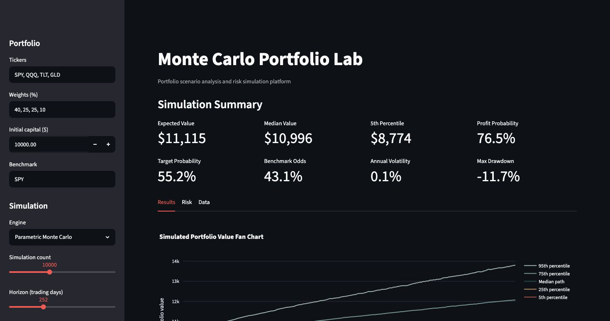
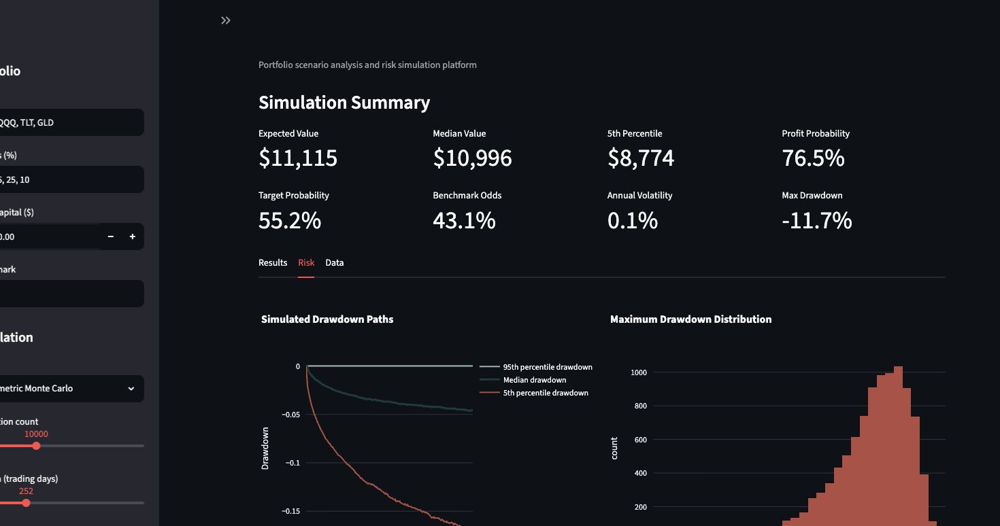
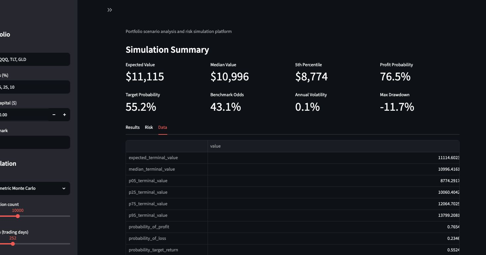
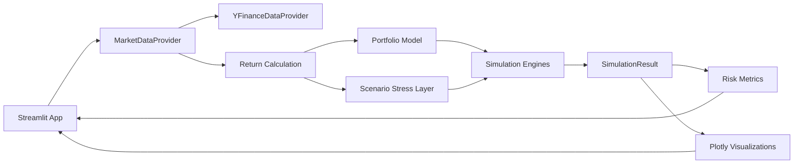

# Monte Carlo Portfolio Lab

Monte Carlo Portfolio Lab is a Streamlit app that simulates thousands of possible portfolio paths using historical market data. It helps compare allocations by showing terminal wealth distributions, downside risk, benchmark-relative outcomes, and stress-test scenarios.

The project is intentionally focused on portfolio scenario analysis. It does not try to predict stock prices or recommend trades. The main goal is to make uncertainty visible and easier to reason about.

**Live demo:** [monte-carlo-portfolio-lab-5hgfmdo3ppvuwfdz2hxgcj.streamlit.app](https://monte-carlo-portfolio-lab-5hgfmdo3ppvuwfdz2hxgcj.streamlit.app/)

## Key Findings

The default configuration uses a $10,000 portfolio allocated 40% to SPY, 25% to QQQ, 25% to TLT, and 10% to GLD. The simulation uses a 5-year historical lookback, 10,000 paths, a 252-trading-day horizon, benchmark SPY, and random seed 42. The figures below were generated from market data through 2026-05-29.

Using the Parametric Monte Carlo engine, the default allocation produced a median one-year terminal value of approximately **$10,996** and an expected terminal value of approximately **$11,115**. The 5th-to-95th percentile terminal value range was approximately **$8,774 to $13,799**.

The same run estimated:

- probability of profit: **76.5%**
- probability of loss: **23.5%**
- probability of reaching the 8% target return: **55.2%**
- probability of beating the median SPY benchmark outcome: **39.3%**
- median simulated maximum drawdown: **-10.8%**

The Historical Bootstrap engine gave a similar baseline result: median terminal value of approximately **$11,016**, expected terminal value of approximately **$11,136**, and a 5th-to-95th percentile range of approximately **$8,795 to $13,885**. In this default case, the two engines tell broadly the same story: the diversified portfolio has a positive central outcome but still has meaningful downside risk, and it does not consistently beat SPY in a one-year simulation.

Under the Market Stress Test scenario, the Parametric engine estimated a much wider range: median terminal value of approximately **$10,111**, 5th percentile terminal value of approximately **$6,093**, and probability of loss of **48.6%**. The Bootstrap stress scenario was slightly less severe at the 5th percentile, around **$6,477**, with a **47.7%** probability of loss. This illustrates the main purpose of the app: assumptions about volatility, correlation, and return shocks can materially change the downside distribution.

These are scenario estimates, not forecasts.

## Default Portfolio Rationale

The default allocation is deliberately simple:

- **SPY** represents broad U.S. equity exposure.
- **QQQ** adds growth and technology-heavy equity exposure.
- **TLT** represents long-duration U.S. Treasury bond exposure.
- **GLD** adds gold exposure as a diversifying asset.

The mix is not meant to be optimal. It is a compact test portfolio with assets that tend to behave differently across market environments, making it useful for demonstrating correlations, drawdowns, and stress scenarios.

## Features

- Build custom portfolios from Yahoo Finance tickers
- Automatically download, clean, and validate adjusted close price data
- Normalize portfolio weights with visible user feedback
- Run two simulation engines:
  - Parametric Monte Carlo with correlated multivariate normal log returns
  - Historical bootstrap resampling of observed return days
- Compare normal, high-volatility, and stress-test scenarios
- Estimate downside risk using drawdowns, VaR, and CVaR
- Compare portfolio outcomes against a benchmark distribution
- Explore allocation comparisons across three example portfolios
- Deploy directly to Streamlit Community Cloud

## Why Monte Carlo Matters

A single expected return hides the range of possible outcomes. Monte Carlo simulation shows a distribution instead. That makes it useful for studying:

- upside and downside ranges
- probability of loss
- tail risk
- benchmark-relative outcomes
- sensitivity to volatility and correlation assumptions

The output is only as good as the assumptions. The value of the tool is not that it knows the future; it makes the assumptions explicit.

## Visual Examples

### Main Dashboard


### Fan Chart


### Terminal Wealth Histogram



### Correlation Heatmap



### Scenario Analysis



### Allocation Comparison


## Architecture



## Methodology

The app downloads adjusted close prices with `yfinance`, cleans missing observations, and converts prices into daily log returns. Log returns are used because they compound cleanly across simulated trading days.

### Parametric Monte Carlo

The parametric engine estimates daily mean log returns and the daily covariance matrix from historical data. It then samples correlated daily log returns from a multivariate normal distribution. This makes the engine easy to explain, but it also inherits the limits of a normal-return assumption, especially in the tails.

### Historical Bootstrap

The bootstrap engine resamples historical return rows. This keeps observed cross-asset co-movement and preserves more of the empirical distribution than a normal model. It is still constrained by the historical sample and does not create market regimes that were not present in the lookback window.

### Scenario Analysis

Scenarios can adjust:

- volatility multiplier
- annual mean-return shock
- correlation stress

Correlation stress pushes correlations closer to 1.0, which is useful because diversification often weakens during broad market selloffs.

## Metrics

Terminal value metrics are calculated across the simulated terminal wealth distribution. Risk ratios and volatility are calculated at the path level first, then summarized across simulated paths.

The dashboard reports:

- expected and median terminal value
- 5th, 25th, 75th, and 95th percentile terminal values
- 5th and 95th percentile terminal returns
- probability of profit and loss
- probability of achieving a target return
- probability of beating the benchmark median terminal return
- median annualized return and volatility across simulated paths
- average and median simulated maximum drawdown
- median path-level Sharpe and Sortino ratios
- 95% Value at Risk and Conditional Value at Risk based on terminal total returns

Benchmark comparison is distribution-based. The main benchmark metric answers: “What percentage of portfolio simulations finished above the benchmark’s median simulated terminal return?” A pathwise comparison is also calculated internally, but the median benchmark comparison is easier to interpret.

## Installation

```bash
git clone https://github.com/Raphael-Azerad/Monte-Carlo-Portfolio-Lab.git
cd Monte-Carlo-Portfolio-Lab
python -m venv .venv
source .venv/bin/activate
pip install -e ".[dev]"
```

## Usage

```bash
streamlit run app.py
```

Default settings:

| Input | Value |
| --- | ---: |
| Starting capital | $10,000 |
| Lookback | 5 years |
| Simulations | 10,000 |
| Horizon | 252 trading days |
| Seed | 42 |
| Benchmark | SPY |
| Target return | 8% |

Default portfolio:

| Ticker | Weight |
| --- | ---: |
| SPY | 40% |
| QQQ | 25% |
| TLT | 25% |
| GLD | 10% |

## Project Structure

```text
Monte-Carlo-Portfolio-Lab/
├── app.py
├── assets/
├── config/
├── data/
├── notebooks/
│   └── 01_methodology_and_validation.ipynb
├── screenshots/
├── src/
│   └── monte_carlo_portfolio_lab/
├── tests/
├── .github/
│   └── workflows/
│       └── ci.yml
├── README.md
├── LICENSE
├── requirements.txt
└── pyproject.toml
```

## Testing

```bash
pytest
ruff check .
black --check .
```

The test suite uses deterministic sample data and does not require live market-data calls.

## Deployment

This repository is prepared for Streamlit Community Cloud.

1. Push the repository to GitHub.
2. Create a new Streamlit Community Cloud app.
3. Select `app.py` as the entrypoint.
4. Streamlit installs dependencies from `requirements.txt`.

## Limitations

- Historical returns do not predict future returns.
- Monte Carlo outputs are scenario estimates, not investment advice.
- The parametric engine assumes normally distributed daily log returns.
- The bootstrap engine cannot simulate regimes absent from the historical window.
- Financial markets can experience tail events beyond modeled expectations.
- Yahoo Finance data may contain revisions, gaps, or symbol-specific quirks.

## Future Improvements

- Block bootstrap simulation
- Rebalancing frequency controls
- Rolling-window covariance estimates
- Factor exposure diagnostics
- Exportable simulation reports
- Optional sample-data mode for offline demos

## Technical Stack

- Python
- Streamlit
- pandas
- NumPy
- SciPy
- Plotly
- yfinance
- pytest
- GitHub Actions

## References

- Hull, J. C. *Risk Management and Financial Institutions*
- McNeil, Frey, and Embrechts. *Quantitative Risk Management*
- Yahoo Finance market data through `yfinance`
- Streamlit documentation
- Plotly Python documentation

## License

MIT License.
